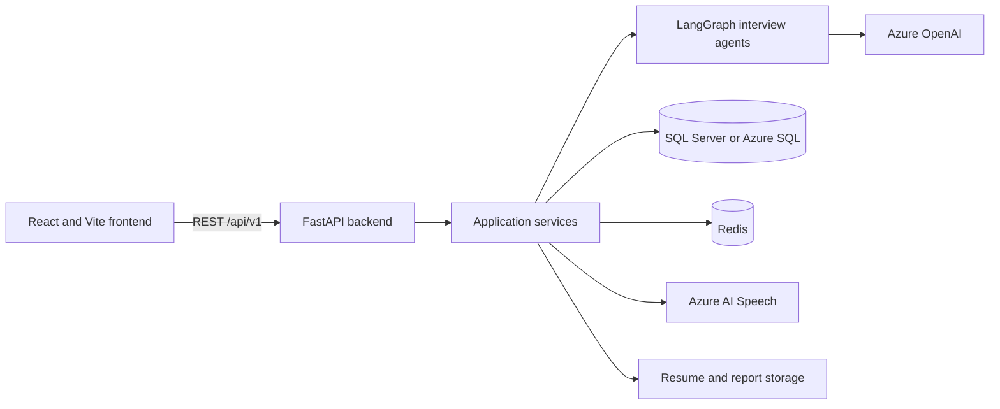

# InterviewAgent

InterviewAgent is an AI-assisted mock interview platform. It combines a React
candidate workspace with a FastAPI API, a LangGraph-based interview workflow,
SQL Server persistence, Redis caching and rate limiting, Azure OpenAI, and Azure
AI Speech.

The application supports account and profile management, resume ingestion,
adaptive interview questions, answer evaluation, voice input/output, scoring,
analytics, and PDF reports. The frontend also has a preview mode that can be
explored without an account or database.

## Architecture



## Repository Modules

| Path | Responsibility |
| --- | --- |
| `frontend/` | React and TypeScript single-page application built with Vite and served by Nginx in containers. |
| `frontend/src/App.tsx` | Authentication, candidate profile, interview setup, live interview, preview mode, and results UI. |
| `frontend/src/api/client.ts` | Typed HTTP client for the backend API and token handling. |
| `frontend/src/hooks/useVoiceConversation.ts` | Browser and backend-assisted voice conversation behavior. |
| `backend/app/main.py` | FastAPI entry point, middleware, telemetry, error handlers, health endpoint, and API registration. |
| `backend/app/api/v1/routers/` | Versioned HTTP endpoints for authentication, resumes, interviews, analytics, reports, and speech. |
| `backend/app/application/services/` | Use-case orchestration for authentication, interviews, scoring, analytics, resumes, reports, and auditing. |
| `backend/app/application/interfaces/` | Repository contracts used to keep application logic independent of persistence details. |
| `backend/app/agents/` | LangGraph state, routing, question agents, evaluation, difficulty adjustment, and final feedback. |
| `backend/app/agents/prompts/` | Prompt templates used by the interview agents. |
| `backend/app/domain/` | Domain entities and enums shared by the application. |
| `backend/app/infrastructure/db/` | Raw `pyodbc` database sessions, row models, and repository implementations. |
| `backend/app/infrastructure/azure_openai/` | Azure OpenAI client integration. |
| `backend/app/infrastructure/azure_speech/` | Azure AI Speech synthesis and recognition integration. |
| `backend/app/infrastructure/cache/` | Redis cache adapter. |
| `backend/app/infrastructure/resume/` | PDF/DOCX text extraction and resume intelligence. |
| `backend/app/infrastructure/pdf/` | Interview report PDF generation. |
| `backend/app/core/` | Configuration, JWT security, role checks, rate limiting, logging, and OpenTelemetry setup. |
| `backend/app/schemas/` | Pydantic request and response contracts. |
| `backend/scripts/init_db.py` | Applies `docs/api/DATABASE_SCHEMA.sql` to SQL Server or Azure SQL. |
| `backend/tests/` | Unit and integration tests. External AI services are mocked by the test configuration. |
| `infra/docker/` | Local full-stack Docker Compose configuration. |
| `infra/k8s/` | Kubernetes namespace, configuration, secrets template, data services, workloads, autoscaling, and ingress. |
| `infra/scripts/create-azure-resources.ps1` | Azure CLI automation for Azure SQL, Azure Cache for Redis, Azure OpenAI, and Azure AI Speech. |
| `docs/api/` | API contracts and the SQL database schema. |

## Interview Agent Flow

The question graph starts with the orchestrator and routes each turn to a
technical, behavioral, system design, or coding agent. The selected sequence is
based on the requested interview type. A separate evaluation graph scores each
answer and adjusts difficulty, and a feedback graph produces the final summary.

The API is exposed under `/api/v1` and includes these functional areas:

- `/register`, `/login`, `/refresh`, and `/me` for identity and profiles
- `/upload-resume` for resume ingestion
- `/start-interview`, `/submit-answer`, `/next-question`, and
  `/interview-score` for the interview lifecycle
- `/analytics` and `/report` for progress and reports
- `/speech-to-text` and `/text-to-speech` for voice features
- `/health` for service health

Interactive API documentation is available at `http://localhost:8000/docs`
while the backend is running.

## Prerequisites

Choose the tools required by the way you plan to run the application:

- Git
- Python 3.11
- Node.js 20 or newer; the frontend container uses Node.js 24
- Microsoft ODBC Driver 18 for SQL Server when the backend runs outside Docker
- Docker Desktop with Docker Compose for the local container stack
- Azure CLI and an Azure subscription for cloud resources
- `kubectl`, a Kubernetes cluster, an ingress controller, and cert-manager for
  the Kubernetes deployment
- Azure OpenAI access and sufficient model quota for AI-generated interviews

## Configuration

Create the backend environment file before running the authenticated workflow:

```powershell
Copy-Item backend/.env.example backend/.env
```

Important settings are:

| Variable | Purpose |
| --- | --- |
| `JWT_SECRET_KEY` | Signs access and refresh tokens. Replace the default outside development. |
| `DATABASE_*` | SQL Server or Azure SQL connection fields. |
| `DATABASE_CONNECTION_STRING` | Optional full ODBC connection string that overrides the individual database fields. |
| `REDIS_URL` | Cache connection used by application services. |
| `RATE_LIMIT_STORAGE_URI` | Rate-limit storage; use the Redis URL for multi-instance deployments. |
| `AZURE_OPENAI_ENDPOINT` | Azure OpenAI resource endpoint. |
| `AZURE_OPENAI_API_KEY` | Azure OpenAI credential. Do not commit it. |
| `AZURE_OPENAI_DEPLOYMENT_GPT4O` | Model deployment name used by the agents. |
| `AZURE_SPEECH_KEY` and `AZURE_SPEECH_REGION` | Azure AI Speech credentials and region. |
| `CORS_ORIGINS` | JSON array of allowed frontend origins. |
| `OTEL_ENABLED` and `OTEL_EXPORTER_OTLP_ENDPOINT` | Optional OpenTelemetry export configuration. |

Keep `.env`, `.env.azure`, passwords, API keys, and connection strings out of
source control. For Azure-hosted production workloads, prefer managed identity
and Azure Key Vault over long-lived keys wherever the selected service and SDK
support them.

## Start Locally

### Option 1: Full stack with Docker Compose

This starts SQL Server, Redis, the backend, and the frontend. Populate
`backend/.env` first with valid Azure OpenAI and optional Speech values.

```powershell
docker compose -f infra/docker/docker-compose.yml up sqlserver redis --detach
docker compose -f infra/docker/docker-compose.yml build backend frontend
docker compose -f infra/docker/docker-compose.yml run --rm --entrypoint python backend -m scripts.init_db
docker compose -f infra/docker/docker-compose.yml up --detach
```

Open:

- Frontend: `http://localhost:5173`
- Backend health: `http://localhost:8000/health`
- API documentation: `http://localhost:8000/docs`

Stop the stack with:

```powershell
docker compose -f infra/docker/docker-compose.yml down
```

Add `--volumes` to the `down` command only when you also want to delete local
SQL Server and application data.

### Option 2: Run backend and frontend as development processes

Start SQL Server and Redis locally, or point `backend/.env` at remote services.
Then install and start the backend:

```powershell
cd backend
python -m venv .venv
Set-ExecutionPolicy -Scope Process -ExecutionPolicy RemoteSigned
.\.venv\Scripts\Activate.ps1
python -m pip install -r requirements.txt -r requirements-dev.txt
python -m scripts.init_db
uvicorn app.main:app --reload --port 8000
```

In a second terminal, start the frontend:

```powershell
cd frontend
npm install
npm run dev
```

Vite serves the UI at `http://localhost:5173` and proxies `/api` and `/health`
to port `8000`.

### Option 3: Preview the UI only

Run the frontend development server and choose **Preview the workspace** on the
sign-in screen. Preview mode uses bundled sample questions and browser speech
features, so it does not require an account or a database. API-backed features
still require the backend.

## Create Azure Resources

The provisioning script creates or reuses a resource group and provisions:

| Azure resource | Default configuration | Application use |
| --- | --- | --- |
| Azure SQL Database | Basic database named `interview_db` | Users, profiles, resumes, interviews, answers, evaluations, reports, and audit records |
| Azure Cache for Redis | Basic C0 | Cache and distributed rate-limit storage |
| Azure OpenAI | S0 with a `gpt-4o-mini` deployment | Question generation, evaluation, and feedback |
| Azure AI Speech | S0 | Speech recognition and synthesis |

1. Sign in and select the intended subscription:

   ```powershell
   az login
   az account list --output table
   az account set --subscription "<subscription-id-or-name>"
   ```

2. Run the provisioning script from the repository root. Resource names receive
   a random suffix because several Azure service names must be globally unique.

   ```powershell
   .\infra\scripts\create-azure-resources.ps1 `
     -SubscriptionId "<subscription-id-or-name>" `
     -ResourceGroup "interviewagent-rg" `
     -Location "eastus" `
     -SqlLocation "eastus2" `
     -NamePrefix "interviewagent"
   ```

   Use `-SkipOpenAI` or `-SkipSpeech` when those resources already exist or
   should not be created. Azure OpenAI availability, model versions, and quota
   vary by subscription and region.

3. The script writes generated values to `backend/.env.azure`. Review that file
   and merge the required values into `backend/.env`. Store the generated SQL
   password securely; the generated files contain secrets.

4. Initialize the Azure SQL schema and start the application:

   ```powershell
   cd backend
   python -m scripts.init_db
   uvicorn app.main:app --reload --port 8000
   ```

The script permits Azure-originated SQL connections and attempts to add the
current public client IP to the SQL firewall. Restrict network access further
for production deployments.

## Build and Publish Container Images

The GitHub Actions workflow builds and publishes both images to GitHub Container
Registry on pushes to `main` or `develop`. For a manual build, replace
`<registry>` and `<tag>` with your registry and release tag:

```powershell
docker build -f backend/Dockerfile -t <registry>/interview-backend:<tag> .
docker build -t <registry>/interview-frontend:<tag> frontend
docker push <registry>/interview-backend:<tag>
docker push <registry>/interview-frontend:<tag>
```

Use immutable release tags or digests for deployments instead of `latest`.

## Deploy to Kubernetes

The files in `infra/k8s` are a deployment baseline and require customization.
They default to an in-cluster SQL Server and Redis, two backend replicas, two
frontend replicas, backend horizontal autoscaling, persistent volumes, Nginx
Ingress, and cert-manager TLS.

Before applying them:

1. Replace both placeholder image names in `infra/k8s/20-backend.yaml` and
   `infra/k8s/21-frontend.yaml` with the images you published.
2. Replace `interview.example.com` and `api.interview.example.com` in the
   ConfigMap and Ingress with your DNS names.
3. Do not commit real values to `infra/k8s/02-secrets.yaml`. Create the secret
   from a secure local file, CI secret store, or Azure Key Vault CSI provider.
4. Decide whether to use the demo in-cluster SQL Server and Redis manifests or
   managed Azure SQL and Azure Cache for Redis. For managed services, update
   `DATABASE_*`, `REDIS_URL`, and `RATE_LIMIT_STORAGE_URI`, then omit
   `10-sqlserver.yaml` and `11-redis.yaml`.
5. Note that `VITE_API_BASE_URL` is consumed when the frontend is built, not
   when the Nginx container starts. Build the frontend for the target API URL,
   or rely on the Nginx `/api` proxy and same-origin routing.

For a demo deployment using the in-cluster data services:

```powershell
kubectl apply -f infra/k8s/00-namespace.yaml
kubectl apply -f infra/k8s/01-configmap.yaml

kubectl -n interview-platform create secret generic interview-backend-secrets `
  --from-literal=JWT_SECRET_KEY="<strong-random-secret>" `
  --from-literal=DATABASE_USER="sa" `
  --from-literal=DATABASE_PASSWORD="<strong-sql-password>" `
  --from-literal=AZURE_OPENAI_ENDPOINT="<azure-openai-endpoint>" `
  --from-literal=AZURE_OPENAI_API_KEY="<azure-openai-key>" `
  --from-literal=AZURE_SPEECH_KEY="<azure-speech-key>"

kubectl apply -f infra/k8s/10-sqlserver.yaml
kubectl apply -f infra/k8s/11-redis.yaml
kubectl apply -f infra/k8s/20-backend.yaml
```

Initialize the database after SQL Server and the backend are ready, then deploy
the frontend and ingress:

```powershell
kubectl -n interview-platform rollout status statefulset/sqlserver
kubectl -n interview-platform rollout status deployment/interview-backend
kubectl -n interview-platform exec deployment/interview-backend -- python -m scripts.init_db
kubectl apply -f infra/k8s/21-frontend.yaml
kubectl apply -f infra/k8s/30-ingress.yaml
```

Verify the deployment:

```powershell
kubectl -n interview-platform get pods,services,ingress
kubectl -n interview-platform rollout status deployment/interview-frontend
kubectl -n interview-platform port-forward service/interview-backend 8000:80
```

Then open `http://localhost:8000/health` in another terminal or browser. Configure
DNS records for the ingress address before using the public host names.

## Tests and Quality Checks

Backend:

```powershell
cd backend
pytest
ruff check .
mypy app --ignore-missing-imports
```

Frontend:

```powershell
cd frontend
npm run lint
npm run build
```

## Troubleshooting

- **The backend cannot load `libodbc` or the SQL driver:** install Microsoft
  ODBC Driver 18 for SQL Server, or run the backend container that already
  includes it.
- **The frontend reports that the API is unavailable:** confirm
  `http://localhost:8000/health` responds and that `CORS_ORIGINS` includes the
  frontend origin.
- **Azure SQL rejects the connection:** verify the server firewall rule, client
  IP, database credentials, encryption settings, and database name.
- **AI requests fail:** verify the Azure OpenAI endpoint, key, deployment name,
  regional availability, and quota. The deployment name must match
  `AZURE_OPENAI_DEPLOYMENT_GPT4O`.
- **Voice features fail:** grant browser microphone permission and verify the
  Speech key and region. Browser speech recognition works best in current Edge
  or Chrome.
- **Kubernetes pods cannot pull images:** confirm the image names and tags and
  configure an image pull secret when the registry is private.

## Remove Resources

Delete the Kubernetes namespace and its namespaced workloads:

```powershell
kubectl delete namespace interview-platform
```

Delete the Azure resource group when it is no longer needed to stop ongoing
charges:

```powershell
az group delete --name "interviewagent-rg" --yes --no-wait
```

Review the resource group before deletion if you used an existing group.

## Additional Documentation

- `docs/START_APPLICATION.md` contains a shorter startup guide.
- `docs/api/API_CONTRACTS.md` describes API request and response contracts.
- `docs/api/DATABASE_SCHEMA.sql` is the source-of-truth SQL schema.